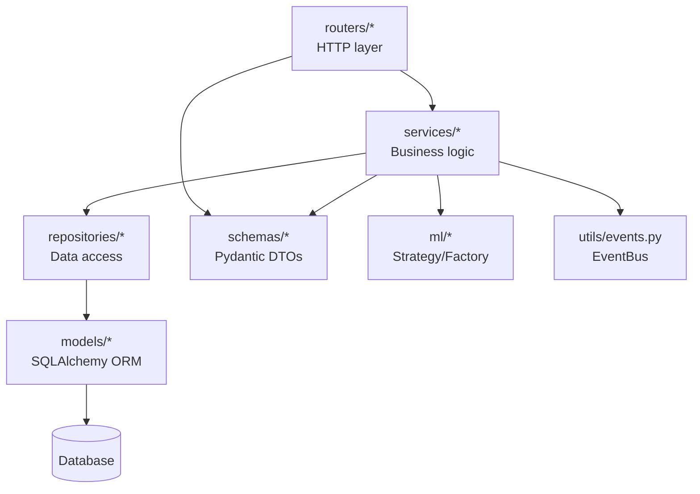
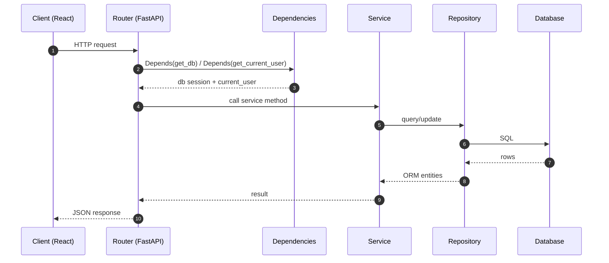
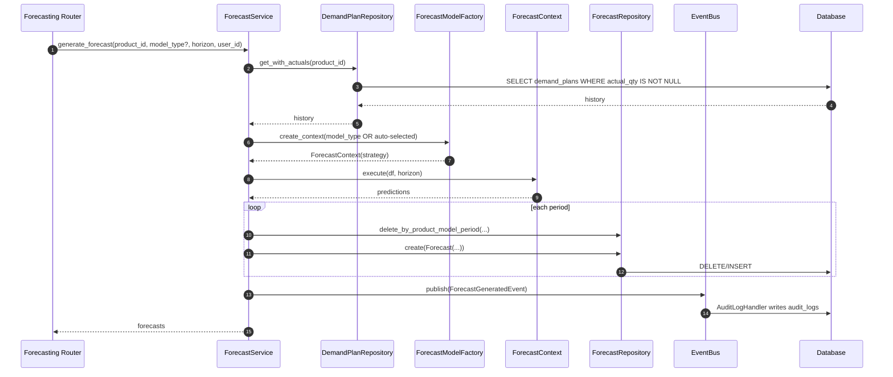

# Backend Architecture (FastAPI)

This document describes the backend architecture implemented under `backend/app/`.

## Backend module map

```
backend/app/
  main.py                # FastAPI app, middleware, router mounting, startup
  config.py              # env-driven settings
  database.py            # SQLAlchemy engine + SessionLocal + Base
  dependencies.py        # auth + role dependencies

  core/                  # domain exceptions
  models/                # SQLAlchemy ORM entities
  schemas/               # Pydantic DTOs
  repositories/          # Repository pattern
  services/              # Service layer
  routers/               # FastAPI APIRouters (thin controllers)
  ml/                    # Strategy + Factory patterns for forecasting
  utils/                 # EventBus (Observer pattern), security helpers
```

## Layering / dependencies

The intended dependency direction:



Notes:

- `main.py` sets up **CORS**, mounts routers, and adds global exception handlers.
- DB access is done via `SessionLocal` (sync SQLAlchemy session).

## Request lifecycle (typical CRUD)



## Key components

### Application entry (`backend/app/main.py`)

- Registers all routers under `/api/v1`.
- Global exception handler converts `GenXSOPException` to a consistent JSON response.
- Startup event:
  - `create_tables()` (creates tables in dev; production would usually use Alembic)
  - `configure_event_bus(SessionLocal)` to attach audit + logging handlers.

### Configuration (`backend/app/config.py`)

- Pydantic settings class `Settings`.
- `CORS_ORIGINS` string is split via `cors_origins_list`.

### Database (`backend/app/database.py`)

- SQLAlchemy engine created from `settings.DATABASE_URL`.
- `SessionLocal` is the per-request DB session factory.
- `Base.metadata.create_all(...)` used in startup.

### Auth + RBAC (`backend/app/dependencies.py`, `backend/app/routers/auth.py`)

- Uses HTTP Bearer tokens.
- `get_current_user` decodes JWT and loads `User`.
- `require_roles([...])` provides role-based access.

### Eventing / audit logging (`backend/app/utils/events.py`)

- `EventBus` is a simple in-process pub/sub.
- Concrete handlers:
  - `LoggingHandler`: logs events
  - `AuditLogHandler`: persists to `audit_logs` table

This pattern allows services to publish events without coupling to persistence/logging concerns.

### Forecasting engine (`backend/app/ml/*`)

- `BaseForecastStrategy` interface.
- Concrete strategies:
  - `MovingAverageStrategy`
  - `ExponentialSmoothingStrategy` (statsmodels)
  - `ProphetStrategy` (prophet)
- `ForecastModelFactory` registers and creates strategies and implements data-length-based auto-selection.

Example runtime flow for forecast generation:



## Routers (API surface)

Mounted in `main.py`:

- `/auth`
- `/dashboard`
- `/products`
- `/demand`
- `/supply`
- `/inventory`
- `/forecasting`
- `/scenarios`
- `/sop-cycles`
- `/kpi`

## Error handling

- Domain exceptions derive from `GenXSOPException` (`backend/app/core/exceptions.py`).
- Global exception handler in `main.py` maps them to structured JSON.

## What to improve next (optional)

- Move from `create_tables()` to Alembic migration-based startup in non-dev environments.
- Add background jobs (e.g., Celery/RQ) for long-running forecast generation.
- Add structured logging + correlation IDs.
