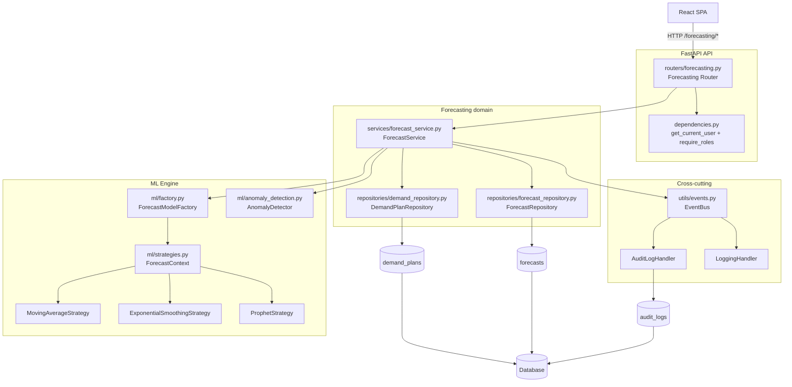
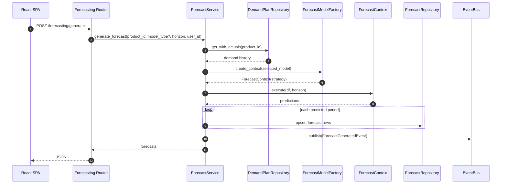

# Components (C4 L3) — Forecasting Domain

This document zooms into the **Forecasting** domain and shows the major backend components and their relationships.

> Why forecasting? It demonstrates GenXSOP’s core patterns clearly: **Router → Service → Repository**, plus **Strategy/Factory** for ML and **EventBus** for audit.

## Component diagram

## Primary endpoint flows

### Generate forecast (`POST /api/v1/forecasting/generate`)

### Detect anomalies (`POST /api/v1/forecasting/anomalies/detect`)

- Loads demand history with actuals.
- Runs `AnomalyDetector.detect(values)`.
- Returns indices/periods considered anomalous.

## Key design notes

- **Strategy interface** (`BaseForecastStrategy`) is the unit of extensibility.
- The **Factory registry** enables adding new models without changing service code.
- Publishing `ForecastGeneratedEvent` enables audit/telemetry without coupling.
