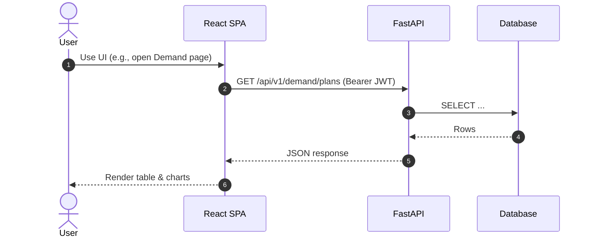

# Containers (C4 L2)

GenXSOP is a classic **SPA + API + DB** architecture.

## Diagram

```mermaid
flowchart TB
  subgraph UserDevice[User device]
    Browser[Browser\nReact SPA (Vite)]
  end

  subgraph Server[Application server]
    API[FastAPI API\nPython 3.11]
  end

  subgraph Data[Data layer]
    DB[(SQLite / PostgreSQL)]
  end

  Browser -->|HTTPS / JSON\nAuthorization: Bearer JWT| API
  API -->|SQLAlchemy ORM\n(Alembic for migrations)| DB
```

## Responsibilities by container

### React SPA (`frontend/`)

- Page routing (`react-router-dom`) and layouts (`src/components/layout/*`).
- State management via **Zustand** (`src/store/*`).
- API client via **Axios** with interceptors (`src/services/api.ts`).
- UI composition: common components, pages, charts.

### FastAPI backend (`backend/`)

- REST API (`/api/v1/*`).
- Authentication and RBAC (JWT via `python-jose`, password hashing via `passlib`).
- Business logic in services.
- Data access via repositories.
- ML forecasting via in-process strategy implementations.
- Audit logging via an EventBus (Observer pattern).

### Database

- Persists domain entities: users, products, plans, forecasts, scenarios, KPI metrics, comments, audit log.
- Dev mode uses SQLite; production expects PostgreSQL.

## Container-level runtime sequence (typical)


