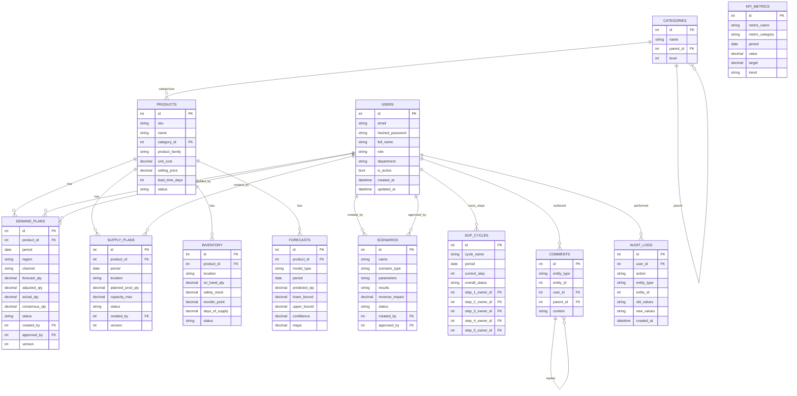

# Data Model

This document summarizes the persisted domain entities implemented under `backend/app/models/*`.

## Entity list

- `User` (`users`)
- `Category` (`categories`)
- `Product` (`products`)
- `DemandPlan` (`demand_plans`)
- `SupplyPlan` (`supply_plans`)
- `Inventory` (`inventory`)
- `Forecast` (`forecasts`)
- `Scenario` (`scenarios`)
- `SOPCycle` (`sop_cycles`)
- `KPIMetric` (`kpi_metrics`)
- `Comment` (`comments`)
- `AuditLog` (`audit_logs`)

## ER diagram (logical)

## Notes / constraints

- Several tables conceptually have uniqueness constraints by `(product_id, period, version, ...)` (as described in the design doc). In the current ORM models, these uniqueness constraints are not explicitly declared; they may be handled via migrations or left for later.
- `Comment` is polymorphic via `(entity_type, entity_id)` rather than strict foreign keys to each domain entity.
- `AuditLog` records entity mutations via the Observer/EventBus.
