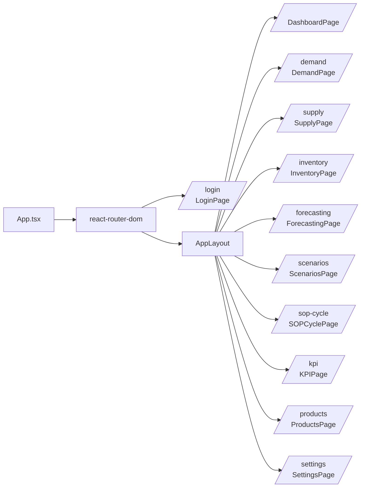
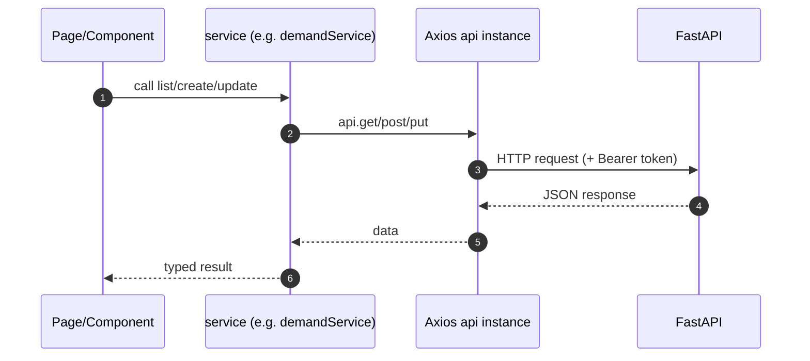

# Frontend Architecture (React + Vite)

This document describes the React SPA under `frontend/`.

## High-level structure

```
frontend/src/
  main.tsx             # React entry
  App.tsx              # Router + lazy page loading
  components/          # shared UI components + feature components
  pages/               # route-level pages
  services/            # API client wrappers
  store/               # Zustand stores
  types/               # shared TypeScript types
  utils/               # formatting helpers
```

## Routing

- The app uses `react-router-dom`.
- `App.tsx` defines public `/login` plus protected routes rendered inside `AppLayout`.
- Pages are lazy-loaded via `React.lazy()` to keep the initial bundle smaller.



## State management (Zustand)

- Auth state is persisted (`zustand/middleware/persist`).
- Token is stored in both Zustand state and `localStorage` (used by Axios request interceptor).

Key store:

- `src/store/authStore.ts`
  - `login()` calls `authService.login()`
  - saves `access_token` in localStorage
  - `fetchMe()` restores the session by calling `/auth/me`

## API access layer

### Axios instance (`src/services/api.ts`)

- `baseURL` from `VITE_API_BASE_URL` (fallback `/api/v1`).
- Request interceptor attaches `Authorization: Bearer <token>` from `localStorage`.
- Response interceptor:
  - 401 → clears token and redirects to `/login`
  - 403/422/500 → shows toast



## Build & dev-server

- Uses **Vite**.
- `vite.config.ts` defines `@` alias to `src/`.
- Dev server proxies `/api` to `http://localhost:8000`.

## UI composition

- Shared components in `src/components/common/*` (Card, Button, Modal, etc.).
- Feature pages under `src/pages/*`.
- Layout components under `src/components/layout/*`.

## What to improve next (optional)

- Centralize token storage to one place (either Zustand only or localStorage only) and implement refresh-token flow.
- Add a typed API client generator (OpenAPI → TS types) to reduce manual types.
