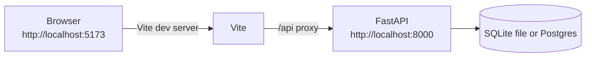
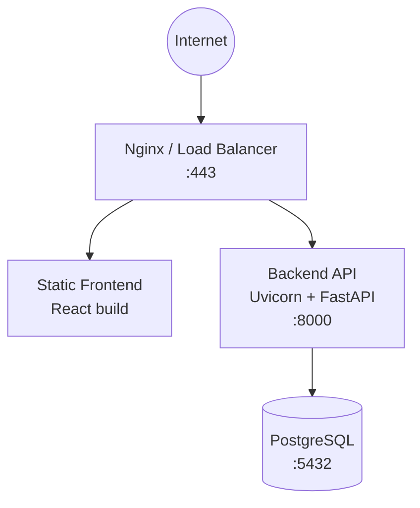

# Runtime & Deployment Architecture

This document describes how GenXSOP runs locally and how it is expected to be deployed.

## Local development runtime

### Components

- **Backend**: FastAPI + Uvicorn (`backend/run.py`)
- **Frontend**: Vite dev server (`npm run dev`) with proxy to backend
- **Database**: SQLite by default (`sqlite:///./genxsop.db`) or PostgreSQL

### Local runtime diagram



### Useful commands

Backend:

```bash
cd backend
python run.py
```

Frontend:

```bash
cd frontend
npm install
npm run dev
```

Convenience scripts:

- `./restart_backend.sh`
- `./restart_frontend.sh`

## Production deployment (reference)

The design document suggests a typical deployment:

- Reverse proxy (Nginx)
- Static SPA hosting (built assets)
- API service (Uvicorn workers)
- Database (PostgreSQL)



## Configuration

Backend settings (`backend/app/config.py`) are env-driven.

Key environment variables:

- `DATABASE_URL`
- `SECRET_KEY`
- `ALGORITHM`
- `ACCESS_TOKEN_EXPIRE_MINUTES`
- `REFRESH_TOKEN_EXPIRE_DAYS`
- `CORS_ORIGINS`
- `DEBUG`

Frontend:

- `VITE_API_BASE_URL`

## Scaling considerations (future)

- Forecast generation can be CPU intensive (Prophet/statsmodels). Consider background jobs and/or separate ML workers.
- Add caching for read-heavy dashboard endpoints.
- Add rate limiting and request IDs at the reverse proxy.
