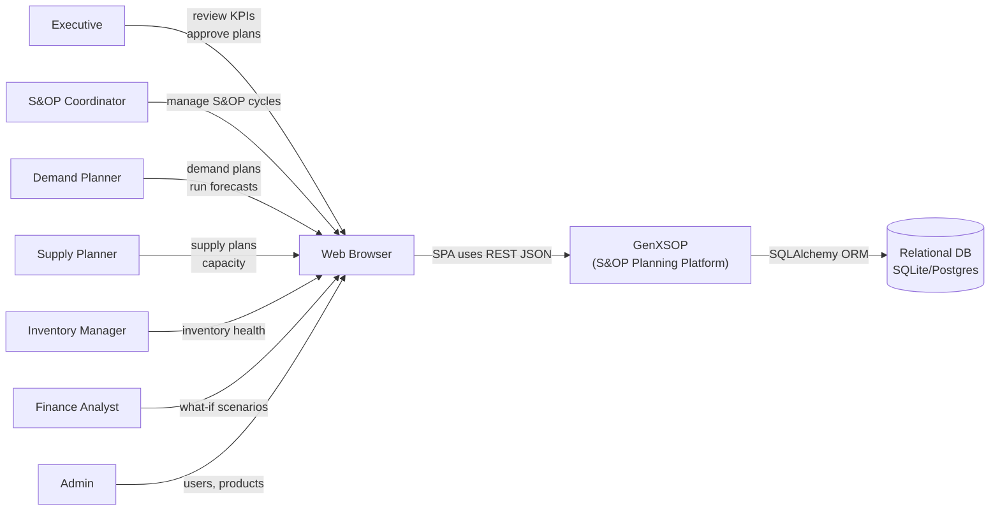

# System Context (C4 L1)

This document describes **who** uses GenXSOP and **what external systems** it interacts with.

## Primary actors

- **Executives / Leadership**: review KPIs, approve plans/scenarios, make decisions.
- **S&OP Coordinator**: manages the monthly S&OP cycle, assigns owners/due dates.
- **Demand Planner**: maintains demand plans, runs forecasts, submits for approval.
- **Supply Planner**: maintains supply plans, evaluates capacity and constraints.
- **Inventory Manager**: maintains inventory parameters and reviews inventory health.
- **Finance Analyst**: runs scenarios and evaluates financial impacts.
- **Admin**: user/product master data management and platform administration.

## External dependencies (current)

- **Relational Database**: SQLite (dev) or PostgreSQL (prod) via SQLAlchemy.
- **Web Browser**: runs the React SPA.

## External dependencies (future / optional)

- Identity provider (SSO) (e.g., Okta/Azure AD)
- ERP / WMS / TMS integrations (master data + actuals)
- Observability stack (centralized logs/metrics/traces)

## Diagram

## Key user journeys (high level)

1. **Authenticate**
   - User logs in → receives JWT access token → SPA calls protected endpoints.
2. **Plan CRUD**
   - Planner creates/updates demand/supply/inventory entries → service layer applies business rules → repository persists.
3. **Forecast**
   - Planner requests forecast generation → service loads history → Strategy executes model → results stored → domain event emitted.
4. **S&OP cycle workflow**
   - Coordinator advances cycle steps → status changes recorded → audit log captured.
